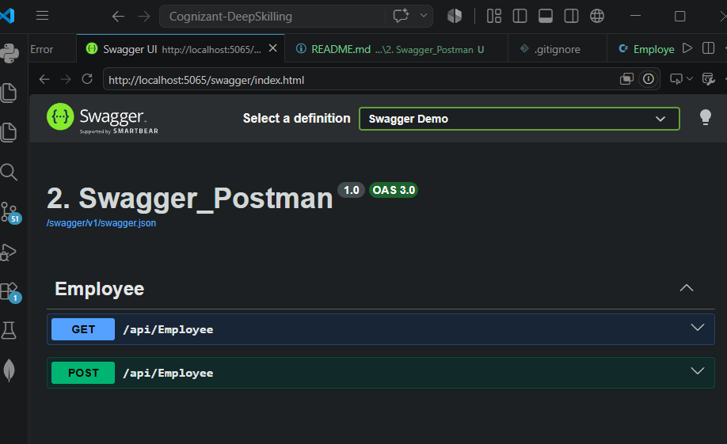
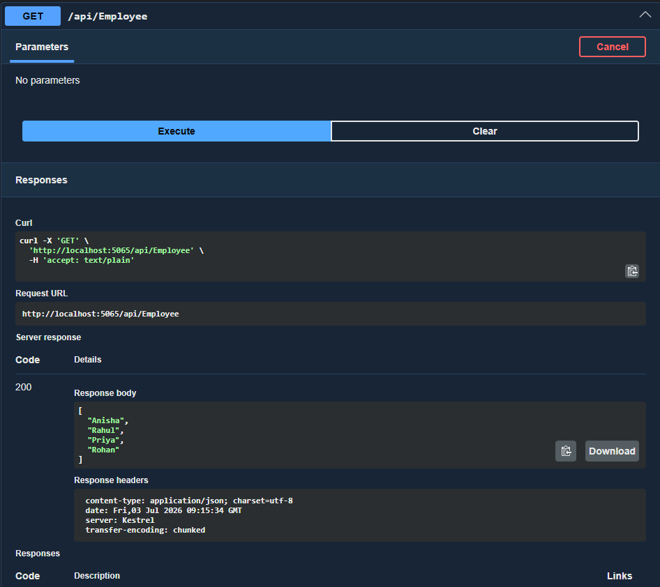
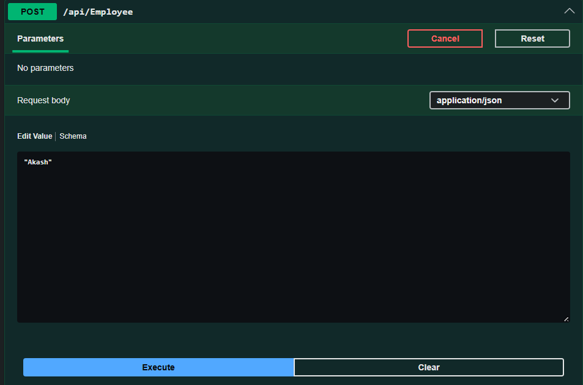
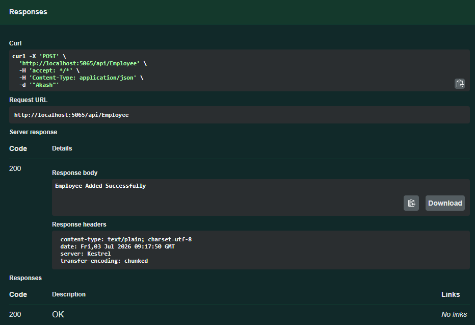

# Lab 2: Web API with Swagger and Postman

Status: ✅ Completed

## Objective

- Integrate Swagger into an ASP.NET Core Web API.
- Test Web API endpoints using Swagger and Postman.
- Demonstrate the use of Route attributes.

---

## Technologies Used

- ASP.NET Core Web API
- C#
- Swagger (Swashbuckle.AspNetCore)
- Postman

---

## API Endpoints

| Method | Endpoint | Description |
|---------|----------|-------------|
| GET | `/api/Employee` | Retrieve all employees |
| POST | `/api/Employee` | Add a new employee |

---
Swagger URL

```
http://localhost:5065/swagger
```

---

## Output

### Swagger UI



### GET Request

```json
[
  "Anisha",
  "Rahul",
  "Priya",
  "Rohan"
]
```



---

### POST Request

Request Body

```json
"Akash"
```

Response

```
Employee Added Successfully
```

![POST]


---

### GET after POST

```json
[
  "Anisha",
  "Rahul",
  "Priya",
  "Rohan",
  "Akash"
]
```

)

---
### Route Attribute

Modified

```csharp
[Route("api/[controller]")]
```
to

```csharp
[Route("api/Emp")]
```

Endpoint:

```
http://localhost:5065/api/Employee


## Conclusion

Successfully integrated Swagger into an ASP.NET Core Web API, tested the API using Swagger and Postman, and demonstrated GET, POST, and custom routing.