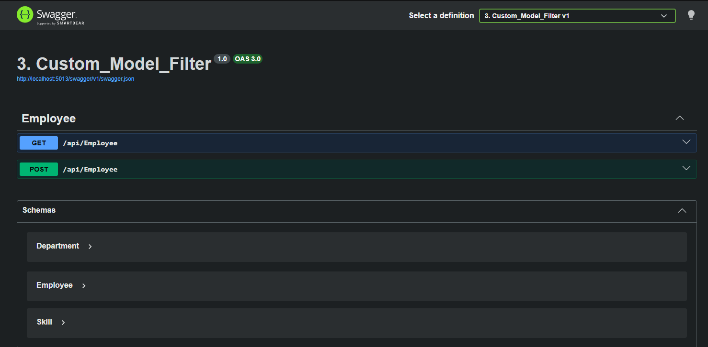
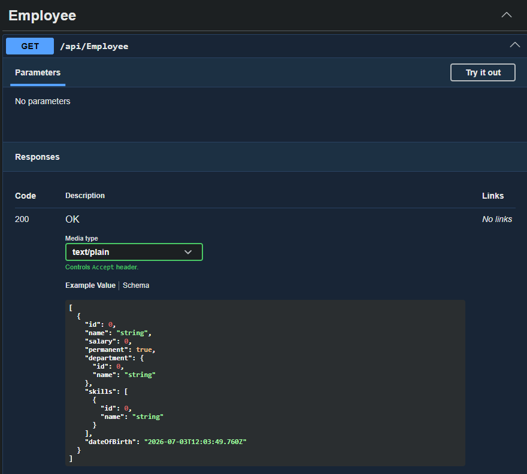
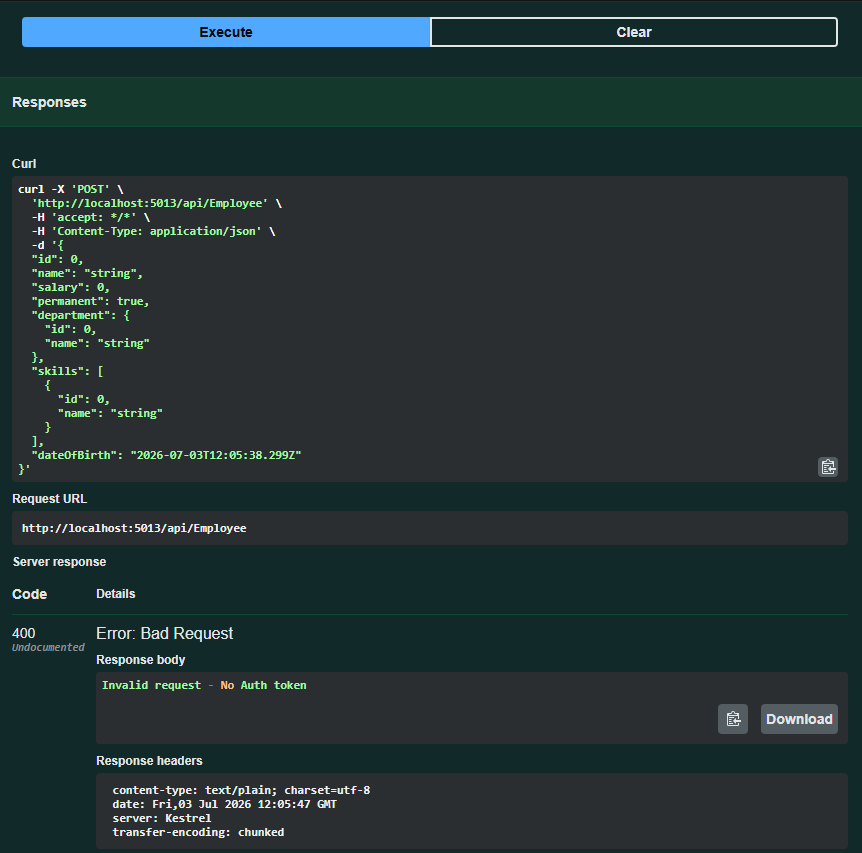

# Lab 3: Custom Model, Authorization Filter & Exception Filter

## Objective

- Create a Web API using custom model classes.
- Return a list of Employee objects.
- Use the `FromBody` attribute to accept request data.
- Implement a custom Authorization Filter.
- Implement a Custom Exception Filter.
- Test the APIs using Swagger and Postman.

---

## Technologies Used

- ASP.NET Core Web API (.NET)
- C#
- Swagger (Swashbuckle.AspNetCore)
- Postman

---

## Project Structure

```
3. Custom_Model_Filter
│
├── Controllers
│   └── EmployeeController.cs
│
├── Models
│   ├── Employee.cs
│   ├── Department.cs
│   └── Skill.cs
│
├── Filters
│   ├── CustomAuthFilter.cs
│   └── CustomExceptionFilter.cs
│
├── Program.cs
├── appsettings.json
├── README.md
└── image.png ...
```

---

## API Endpoints

| Method | Endpoint | Description |
|---------|----------|-------------|
| GET | `/api/Employee` | Get Employee List |
| POST | `/api/Employee` | Add Employee |

---

## How to Run

```bash
dotnet restore
dotnet build
dotnet run
```

Swagger URL

```
http://localhost:5013/swagger
```

---

## Output

### 1. Swagger Home



---

### 2. GET Employee

Returns the list of Employee objects.


(image-2.png)

---

### 3. POST Employee

Adds a new Employee using the `FromBody` attribute.



---

### 4. Authorization Filter (No Header)

Response:

```
400 Bad Request

Invalid request - No Auth token
```

---

### 5. Invalid Authorization Header

Header

```
Authorization: Token abc123
```

Response

```
400 Bad Request

Invalid request - Token present but Bearer unavailable
```

---

### 6. Valid Authorization Header

Header

```
Authorization: Bearer abc123
```

Response

```
200 OK
```

Employee list is returned successfully.
---

### 7. Custom Exception Filter

The exception filter catches unhandled exceptions, logs the exception details to a file, and returns a **500 Internal Server Error** response.

---

## Learning Outcomes

- Created custom model classes.
- Returned custom objects from Web API.
- Used the `FromBody` attribute.
- Implemented a custom Authorization Filter.
- Implemented a Custom Exception Filter.
- Tested APIs using Swagger and Postman.

---

## Conclusion

Successfully developed an ASP.NET Core Web API that uses custom model classes, request validation through a custom authorization filter, and centralized exception handling using a custom exception filter. The API was tested successfully using Swagger and Postman.