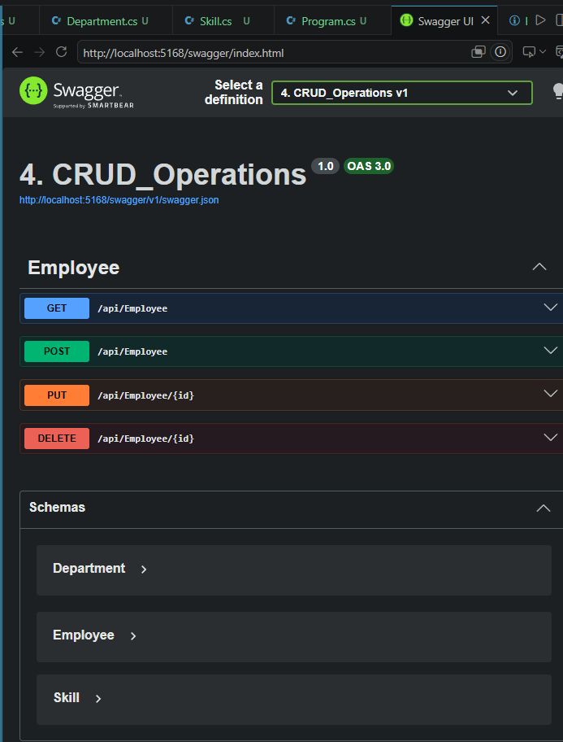
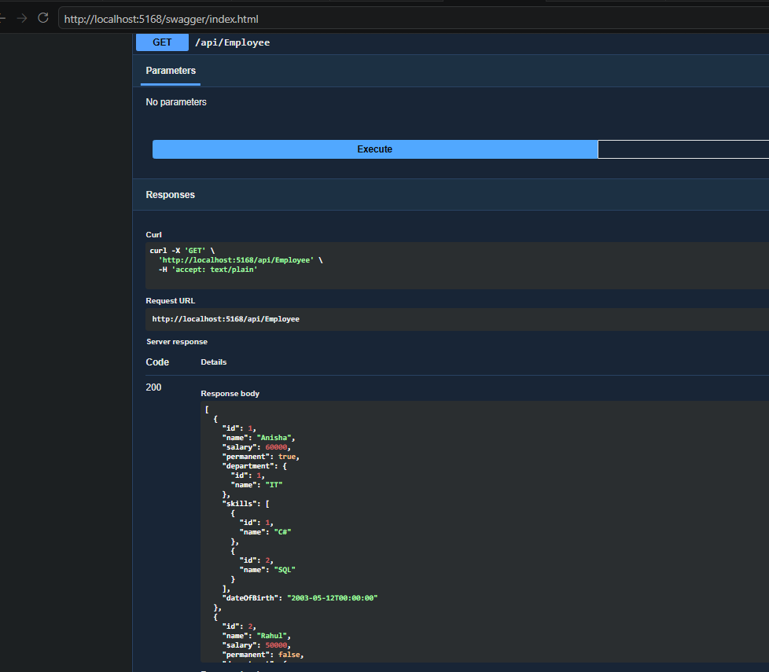
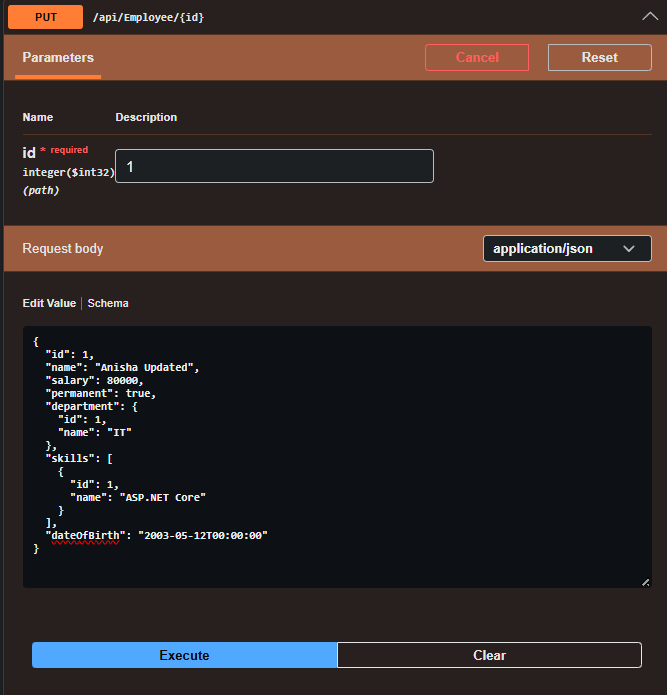
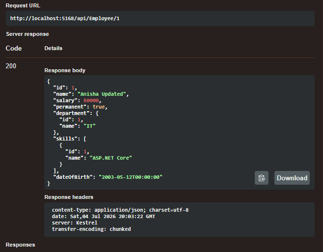
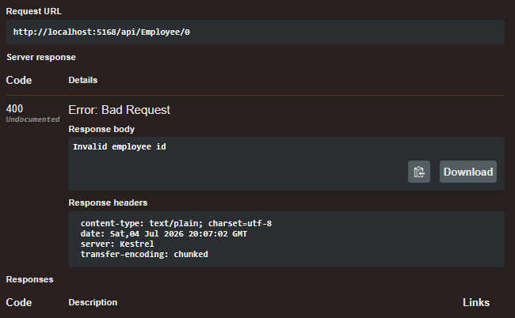
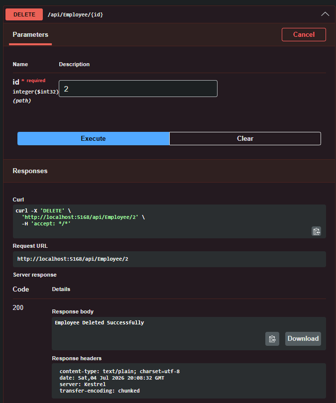
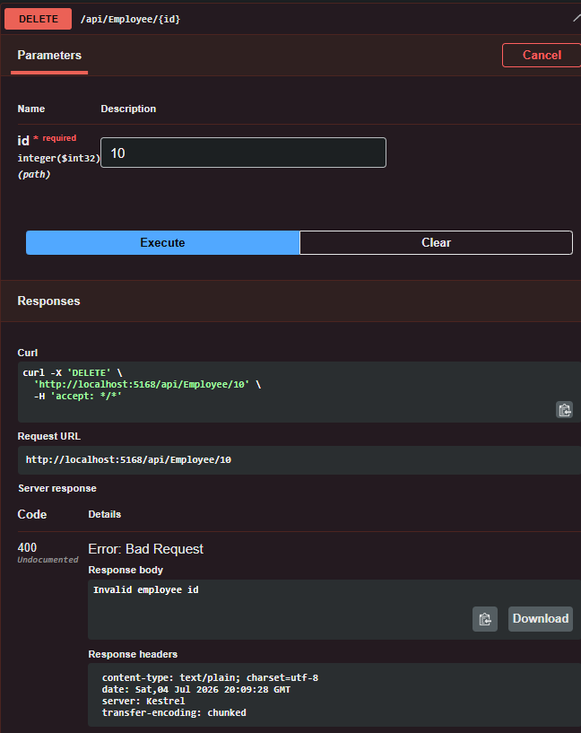

# Lab 4: CRUD Operations using ASP.NET Core Web API
Status: ✅ Completed

## Objective

- Perform Create, Read, Update, and Delete (CRUD) operations using ASP.NET Core Web API.
- Use the `FromBody` attribute to receive JSON data.
- Validate employee ID before updating or deleting records.
- Test the API using Swagger.

---

## Technologies Used

- ASP.NET Core Web API
- C#
- Swagger (Swashbuckle.AspNetCore)

---

## Project Structure

```
4. CRUD_Operations
│
├── Controllers
│   └── EmployeeController.cs
│
├── Models
│   ├── Employee.cs
│   ├── Department.cs
│   └── Skill.cs
│
├── Program.cs
├── appsettings.json
├── README.md
└── image.png ...
```

---

## API Endpoints

| Method | Endpoint | Description |
|---------|----------|-------------|
| GET | `/api/Employee` | Retrieve all employees |
| POST | `/api/Employee` | Add a new employee |
| PUT | `/api/Employee/{id}` | Update an existing employee |
| DELETE | `/api/Employee/{id}` | Delete an employee |

---

## How to Run

```bash
dotnet restore
dotnet build
dotnet run
```

Open Swagger:

```
http://localhost:5168/swagger
```

---

## Output

### 1. Swagger Home



---

### 2. GET Employee

Displays the list of employees.



---

### 3. POST Employee

Adds a new employee successfully.




---

### 4. PUT Employee (Success)

Updates employee information successfully.




---

### 5. PUT Employee (Invalid ID)

Returns:

```
400 Bad Request

Invalid employee id
```



---

### 6. DELETE Employee (Success)

Deletes the selected employee.



---

### 7. DELETE Employee (Invalid ID)

Returns:

```
400 Bad Request

Invalid employee id
```



---

## Learning Outcomes

- Implemented CRUD operations using ASP.NET Core Web API.
- Used `FromBody` to bind JSON request data.
- Validated employee IDs before update and delete operations.
- Returned appropriate HTTP status codes.
- Tested REST APIs using Swagger.

---

## Conclusion

Successfully implemented CRUD operations on Employee data using ASP.NET Core Web API. The application supports creating, retrieving, updating, and deleting employee records with proper validation and was tested successfully using Swagger.