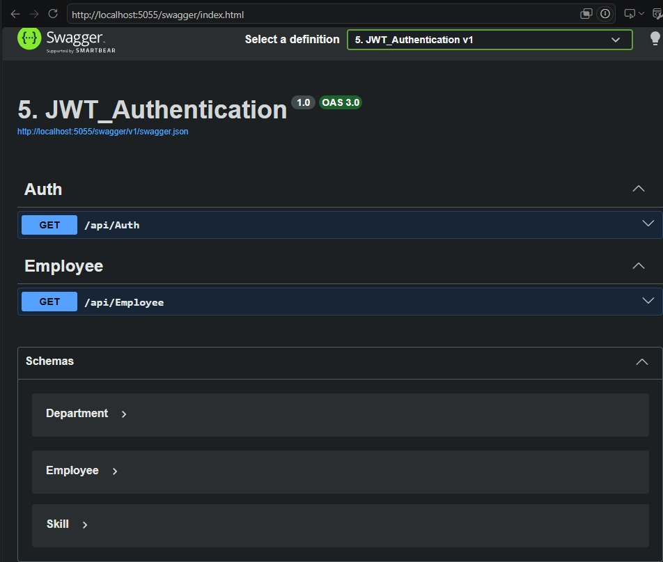
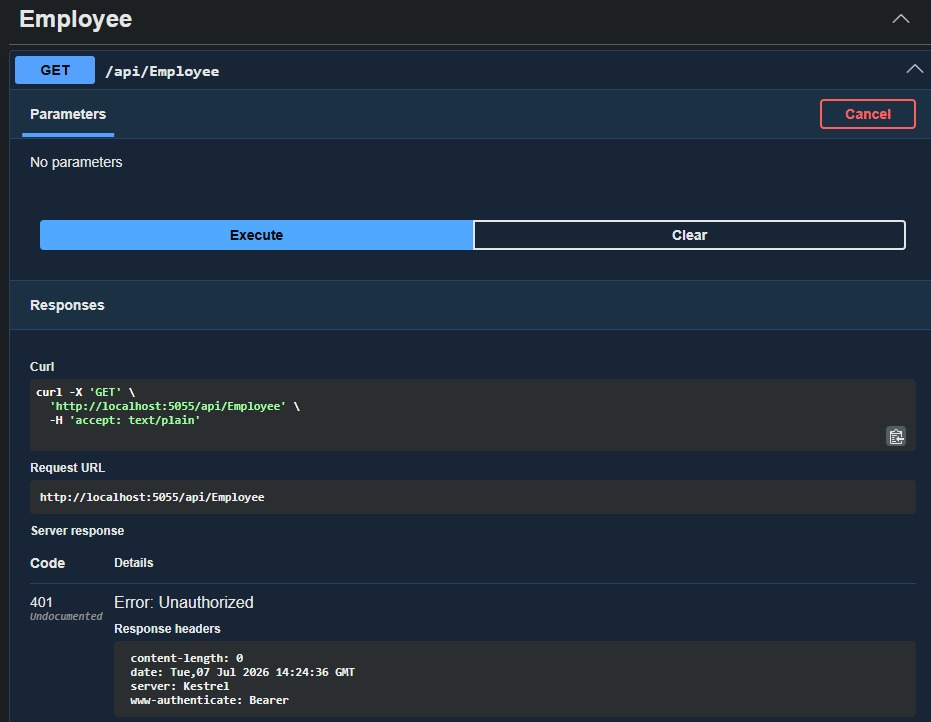
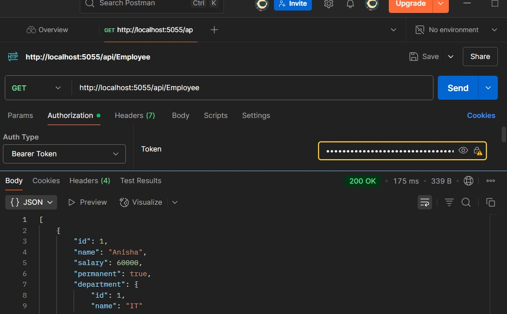
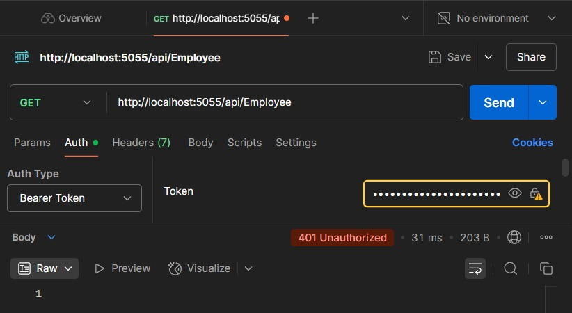
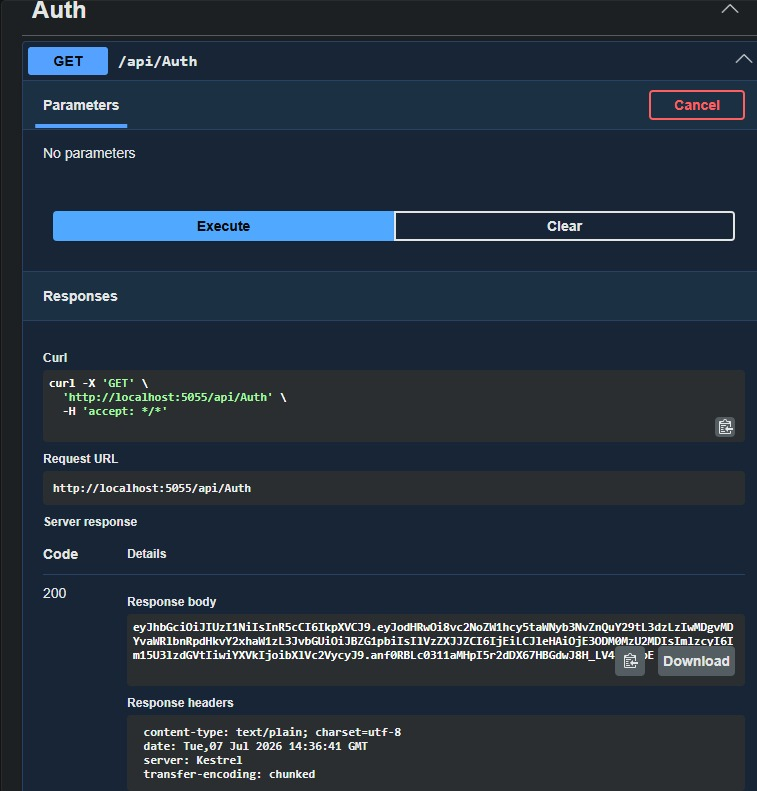
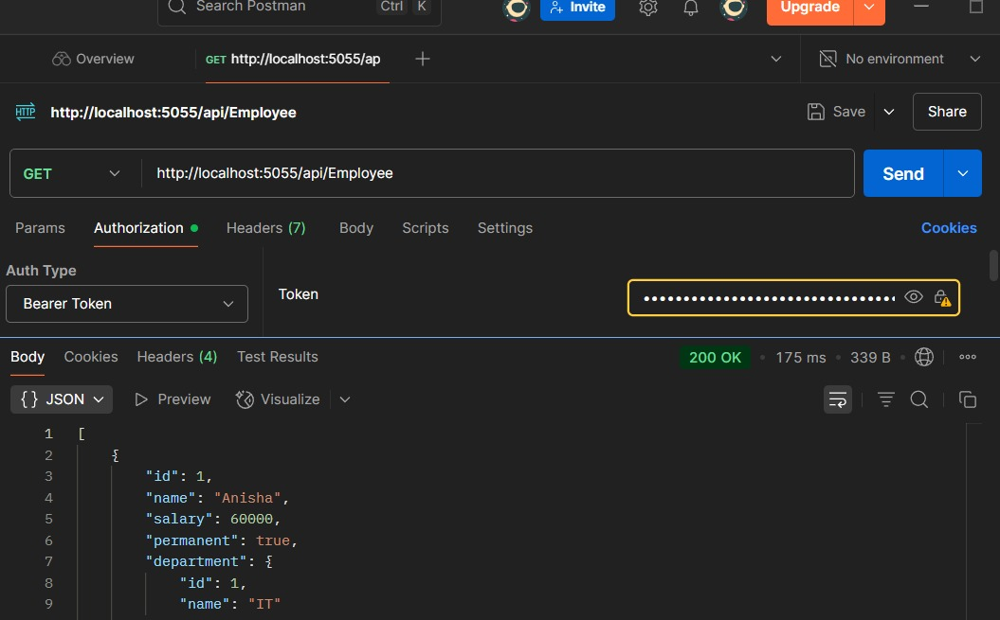

# ASP.NET Core 8.0 Web API - Lab 5: JWT Authentication

## Objective
- Implement JWT (JSON Web Token) Authentication in ASP.NET Core Web API.
- Secure API endpoints using the `[Authorize]` attribute.
- Generate JWT tokens using an Authentication Controller.
- Test authenticated APIs using Swagger and Postman.
- Verify invalid token, expired token, and role-based authorization.

---

## Technologies Used
- ASP.NET Core Web API
- JWT Authentication
- Swagger
- Postman
- C#

---

## Project Structure

```
5. JWT_Authentication
│── Controllers
│   ├── AuthController.cs
│   └── EmployeeController.cs
│
│── Models
│   ├── Employee.cs
│   ├── Department.cs
│   └── Skill.cs
│
│── Program.cs
│── appsettings.json
│── README.md
```

---

## Features

- JWT Token Generation
- Secure Employee API
- Authentication using Bearer Token
- Role-Based Authorization
- Token Expiration Validation
- Swagger API Documentation
- Postman API Testing

---

## API Endpoints

| Method | Endpoint | Description |
|---------|----------|-------------|
| GET | `/api/Auth` | Generate JWT Token |
| GET | `/api/Employee` | Get Employee List (Protected) |

---

## Testing

### Generate JWT Token

Generate a JWT token using:

```
GET /api/Auth
```

---

### Access Protected API

Use the generated JWT token in Postman.

Authorization Type:

```
Bearer Token
```

Request:

```
GET /api/Employee
```

---

### Validation Performed

- Access without token → **401 Unauthorized**
- Access with valid token → **200 OK**
- Invalid token → **401 Unauthorized**
- Expired token → **401 Unauthorized**
- Invalid role → **403 Forbidden**
- Valid role → **200 OK**

---

## Output Screenshots

### Swagger Home

![Swagger]# ASP.NET Core 8.0 Web API - Lab 5: JWT Authentication

## Objective
- Implement JWT (JSON Web Token) Authentication in ASP.NET Core Web API.
- Secure API endpoints using the `[Authorize]` attribute.
- Generate JWT tokens using an Authentication Controller.
- Test authenticated APIs using Swagger and Postman.
- Verify invalid token, expired token, and role-based authorization.

---

## Technologies Used
- ASP.NET Core Web API
- JWT Authentication
- Swagger
- Postman
- C#

---

## Project Structure

```
5. JWT_Authentication
│── Controllers
│   ├── AuthController.cs
│   └── EmployeeController.cs
│
│── Models
│   ├── Employee.cs
│   ├── Department.cs
│   └── Skill.cs
│
│── Program.cs
│── appsettings.json
│── README.md
```

---

## Features

- JWT Token Generation
- Secure Employee API
- Authentication using Bearer Token
- Role-Based Authorization
- Token Expiration Validation
- Swagger API Documentation
- Postman API Testing

---

## API Endpoints

| Method | Endpoint | Description |
|---------|----------|-------------|
| GET | `/api/Auth` | Generate JWT Token |
| GET | `/api/Employee` | Get Employee List (Protected) |

---

## Testing

### Generate JWT Token

Generate a JWT token using:

```
GET /api/Auth
```

---

### Access Protected API

Use the generated JWT token in Postman.

Authorization Type:

```
Bearer Token
```

Request:

```
GET /api/Employee
```

---

### Validation Performed

- Access without token → **401 Unauthorized**
- Access with valid token → **200 OK**
- Invalid token → **401 Unauthorized**
- Expired token → **401 Unauthorized**
- Invalid role → **403 Forbidden**
- Valid role → **200 OK**

---

## Output Screenshots

### Swagger Home



### JWT Token Generation


### Unauthorized Request (Without Token)



### Authorized Request (Valid Token)


### Invalid Token


### Expired Token



### Invalid Role (403 Forbidden)



### Valid Role (200 OK)


---

## Conclusion


### JWT Token Generation
# ASP.NET Core 8.0 Web API - Lab 5: JWT Authentication

## Objective
- Implement JWT (JSON Web Token) Authentication in ASP.NET Core Web API.
- Secure API endpoints using the `[Authorize]` attribute.
- Generate JWT tokens using an Authentication Controller.
- Test authenticated APIs using Swagger and Postman.
- Verify invalid token, expired token, and role-based authorization.

---

## Technologies Used
- ASP.NET Core Web API
- JWT Authentication
- Swagger
- Postman
- C#

---

## Project Structure

```
5. JWT_Authentication
│── Controllers
│   ├── AuthController.cs
│   └── EmployeeController.cs
│
│── Models
│   ├── Employee.cs
│   ├── Department.cs
│   └── Skill.cs
│
│── Program.cs
│── appsettings.json
│── README.md
```

---

## Features

- JWT Token Generation
- Secure Employee API
- Authentication using Bearer Token
- Role-Based Authorization
- Token Expiration Validation
- Swagger API Documentation
- Postman API Testing

---

## API Endpoints

| Method | Endpoint | Description |
|---------|----------|-------------|
| GET | `/api/Auth` | Generate JWT Token |
| GET | `/api/Employee` | Get Employee List (Protected) |

---

## Testing

### Generate JWT Token

Generate a JWT token using:

```
GET /api/Auth
```

---

### Access Protected API

Use the generated JWT token in Postman.

Authorization Type:

```
Bearer Token
```

Request:

```
GET /api/Employee
```

---

### Validation Performed

- Access without token → **401 Unauthorized**
- Access with valid token → **200 OK**
- Invalid token → **401 Unauthorized**
- Expired token → **401 Unauthorized**
- Invalid role → **403 Forbidden**
- Valid role → **200 OK**

---

## Output Screenshots

### Swagger Home


### JWT Token Generation



### Unauthorized Request (Without Token)


### Authorized Request (Valid Token)


### Invalid Token


### Expired Token


### Invalid Role (403 Forbidden)


### Valid Role (200 OK)


---


## Conclusion

This lab demonstrates secure REST API development using JWT Authentication in ASP.NET Core Web API. Authentication, authorization, token validation, expiration handling, and role-based access control were successfully implemented and tested using Swagger and Postman.
