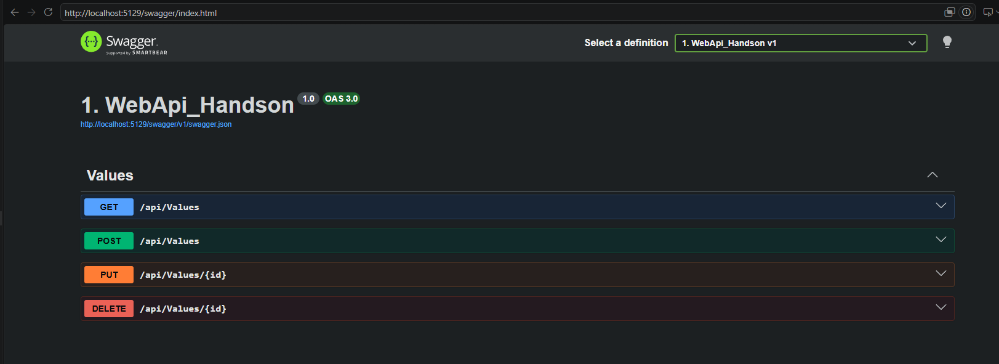
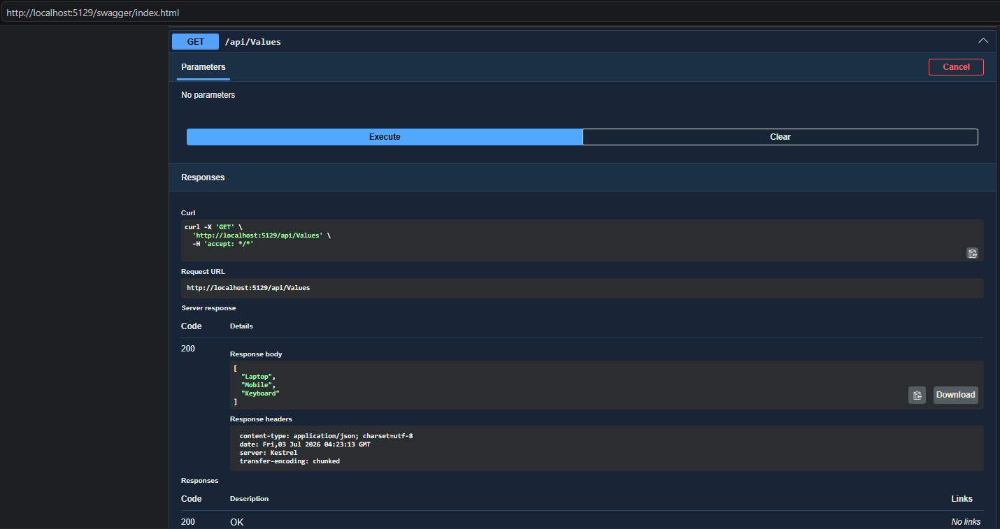
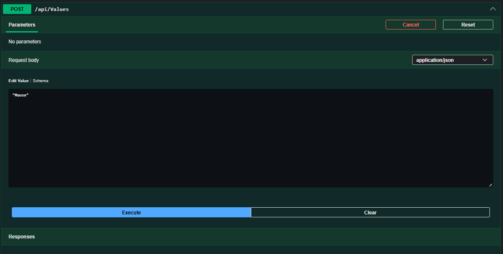
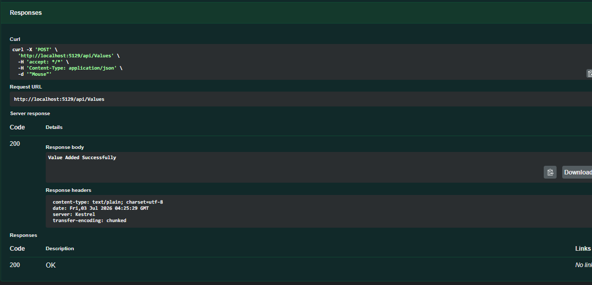
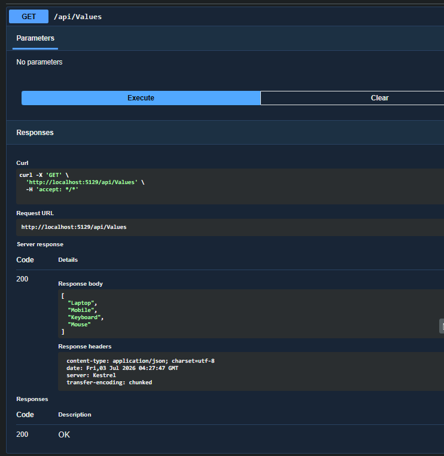
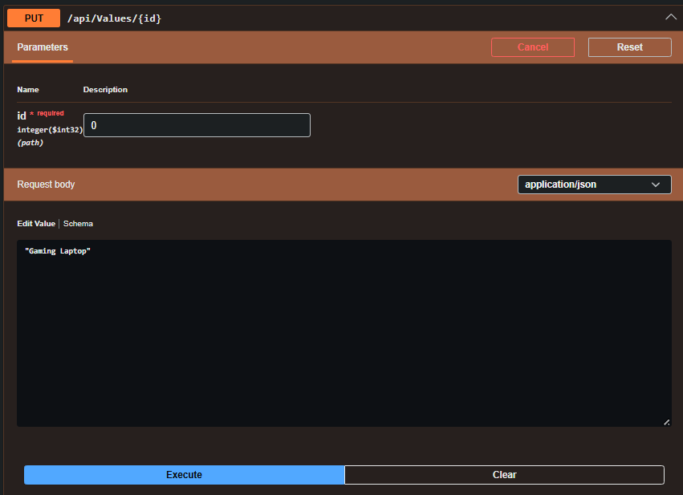
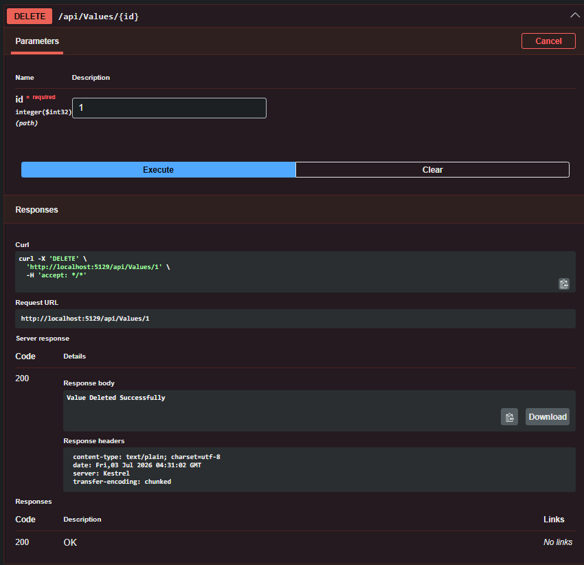

# Lab 1: First Web API using ASP.NET Core

## Objective

- Understand the concept of RESTful Web Services.
- Learn about Web API and HTTP Action Verbs.
- Create a simple ASP.NET Core Web API.
- Perform CRUD operations using GET, POST, PUT, and DELETE.
- Test the API using Swagger UI.

---

## Technologies Used

- ASP.NET Core Web API
- .NET 10 SDK
- C#
- Swagger (OpenAPI)

---

## Project Structure

```text
1. WebApi_Handson
│
├── Controllers
│   └── ValuesController.cs
├── Properties
│   └── launchSettings.json
├── Program.cs
├── appsettings.json
├── 1. WebApi_Handson.csproj
└── README.md
```

---

## HTTP Action Verbs Implemented

| Method | Endpoint | Description |
|---------|----------|-------------|
| GET | `/api/Values` | Retrieve all values |
| POST | `/api/Values` | Add a new value |
| PUT | `/api/Values/{id}` | Update an existing value |
| DELETE | `/api/Values/{id}` | Delete a value |

---

## Output

### 1. Swagger UI

Swagger displays all the available API endpoints.

**Screenshot:**



---

### 2. GET Request

**Endpoint**

```
GET /api/Values
```

**Response**

```json
[
  "Laptop",
  "Mobile",
  "Keyboard"
]
```

**Screenshot:**



---

### 3. POST Request

**Endpoint**

```
POST /api/Values
```

**Request Body**

```json
"Mouse"
```

**Response**

```
Value Added Successfully
```

**Screenshot:**





---

### 4. PUT Request

**Endpoint**

```
PUT /api/Values/0
```

**Request Body**

```json
"Gaming Laptop"
```

**Response**

```
Value Updated Successfully
```

**Screenshot:**


(image-6.png)

---

### 5. DELETE Request

**Endpoint**

```
DELETE /api/Values/1
```

**Response**

```
Value Deleted Successfully
```

**Screenshot:**



---

## How to Run the Project

### Restore Packages

```bash
dotnet restore
```

### Build

```bash
dotnet build
```

### Run

```bash
dotnet run
```

---

## Access the API

### Swagger UI

```
http://localhost:5129/swagger/index.html
```

### GET Endpoint

```
http://localhost:5129/api/Values
```

---

## Features

- RESTful Web API
- Controller-based architecture
- Swagger documentation
- CRUD operations
- HTTP GET, POST, PUT, DELETE
- JSON response format

---

## Expected Output

### Initial GET Response

```json
[
  "Laptop",
  "Mobile",
  "Keyboard"
]
```

After performing POST, PUT, and DELETE operations, the data updates accordingly.

---

## Conclusion

This lab demonstrates the creation of a simple ASP.NET Core Web API using controller-based architecture. The API successfully implements CRUD operations through HTTP action verbs (GET, POST, PUT, and DELETE) and is tested using Swagger UI.