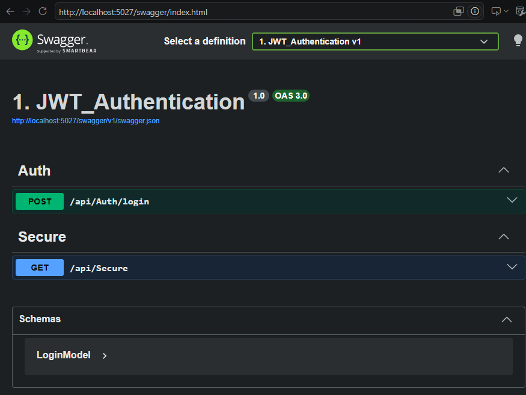
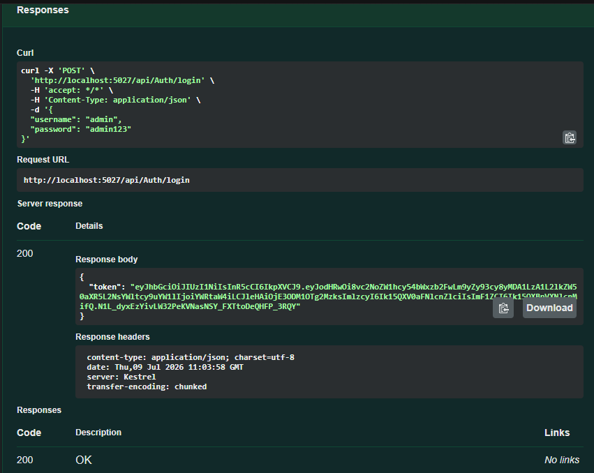
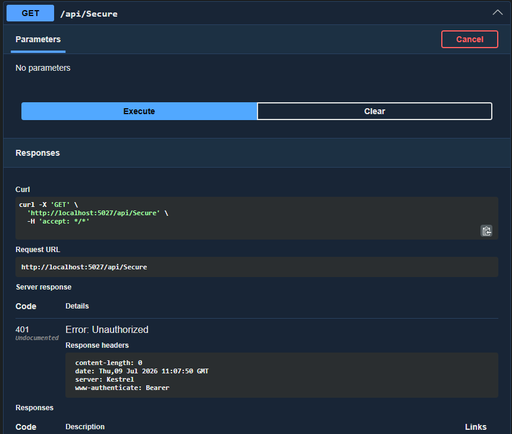
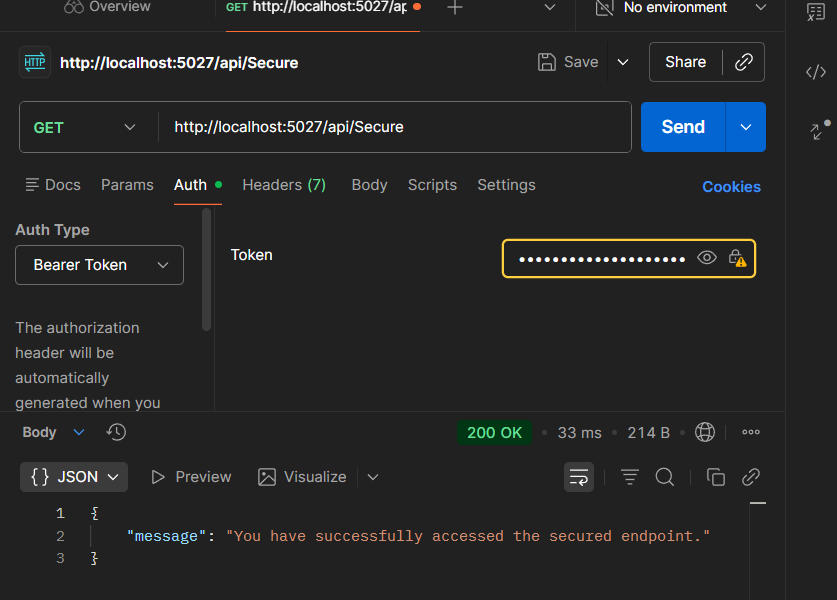

# JWT Authentication in ASP.NET Core Web API

## Objective

Implement JWT-based authentication in an ASP.NET Core Web API, generate a JWT token after successful login, and secure API endpoints using the `[Authorize]` attribute.

## Technologies Used

- ASP.NET Core Web API
- C#
- JWT (JSON Web Token)
- Swagger
- Postman

## Project Structure

```text
1. JWT_Authentication/
├── Controllers/
│   ├── AuthController.cs
│   └── SecureController.cs
├── Models/
│   ├── LoginModel.cs
│   └── User.cs
├── Properties/
├── Program.cs
├── appsettings.json
└── README.md
```

## API Endpoints

| Method | Endpoint | Description |
|--------|----------|-------------|
| POST | `/api/Auth/login` | Validates login credentials and generates a JWT token |
| GET | `/api/Secure` | Protected endpoint requiring a valid Bearer token |

## Testing

### 1. Generate JWT Token

Send a POST request to:

```text
/api/Auth/login
```

Request body:

```json
{
  "username": "admin",
  "password": "admin123"
}
```

A successful login returns a JWT token with status **200 OK**.

### 2. Access Without Token

Accessing the protected endpoint without a JWT token returns:

```text
401 Unauthorized
```

### 3. Access With Valid Token

The generated JWT token is passed through Postman using:

```text
Authorization → Bearer Token
```

A valid token successfully accesses the protected endpoint and returns:

```text
200 OK
```

Response:

```json
{
  "message": "You have successfully accessed the secured endpoint."
}
```

## Output Screenshots

###  Swagger


### JWT Token Generation


### Unauthorized Access



### Successful Authorized Access



## Conclusion

This exercise demonstrates JWT-based authentication in ASP.NET Core Web API. A JWT token is generated after successful login, and protected endpoints are secured using the `[Authorize]` attribute and accessed using Bearer token authentication.