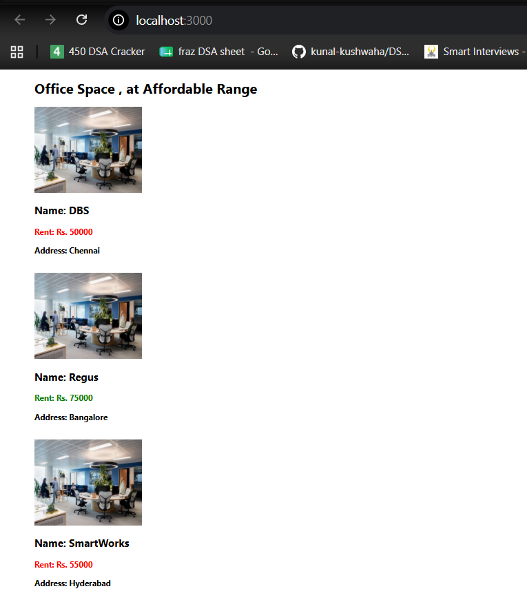

# React Lab 10 - Office Space Rental App

## Objective

- Learn JSX in React.
- Render elements using JSX.
- Display objects using map().
- Apply inline CSS styling.
- Render images and attributes.

## Technologies Used

- React
- JavaScript (ES6)
- JSX
- Node.js

## Features

- Office space details displayed using JSX.
- Multiple office spaces rendered using `map()`.
- Inline styling applied.
- Rent displayed in:
  - **Red** if below ₹60,000
  - **Green** if ₹60,000 or above.

## Commands Used

```bash
npx create-react-app officespacerentalapp
npm start
```

## Output



## Conclusion

Successfully created a React application using JSX, rendered office space data dynamically, and applied conditional inline CSS based on rent.