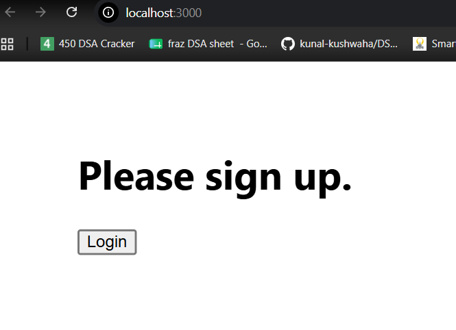
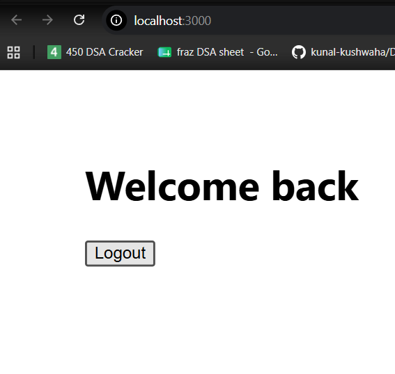

# React Lab 12 - Ticket Booking App

## Objective

- Learn Conditional Rendering in React.
- Implement Login and Logout functionality.
- Display different components based on login status.

## Technologies Used

- React
- JavaScript
- Node.js

## Features

- Guest Greeting
- User Greeting
- Login Button
- Logout Button
- Conditional Rendering using React State

## Commands Used

```bash
npx create-react-app ticketbookingapp
npm start
```

## Output

- Guest page with Login button.


- User page with Logout button.


## Conclusion

Successfully implemented conditional rendering in React by switching between Guest and User views using Login and Logout buttons.