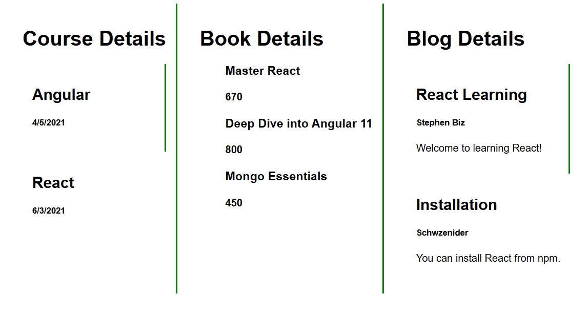

# React Lab 13 - Blogger App

## Objective

- Learn Conditional Rendering.
- Render Multiple Components.
- Use map().
- Use Keys in Lists.
- Display Multiple Components.

## Technologies Used

- React
- JavaScript
- Node.js

## Components

- Book Details
- Blog Details
- Course Details

## Features

- Render multiple React components.
- Use `map()` to display lists.
- Use React keys.
- Demonstrate conditional rendering.

## Commands

```bash
npx create-react-app bloggerapp
npm start
```

## Output



- Course Details
- Book Details
- Blog Details

## Conclusion

Successfully implemented multiple React components using conditional rendering, list rendering with `map()`, and unique keys.