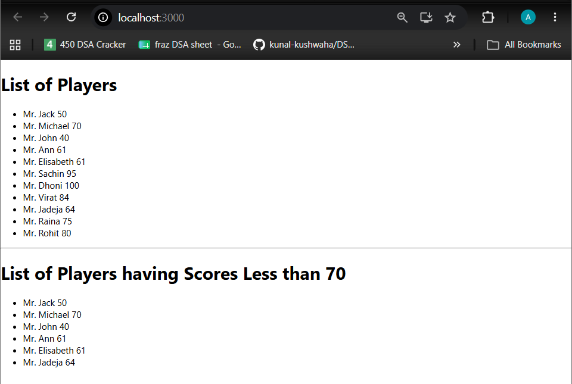
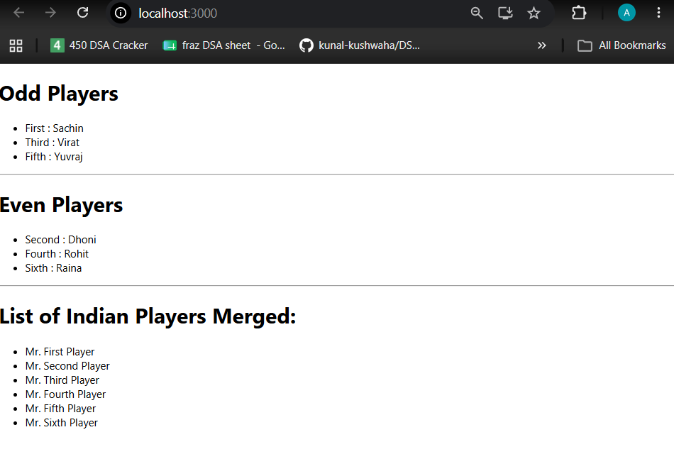

# React Lab 9 - ES6 Features

## Objective

- Understand ES6 features in React.
- Implement map().
- Use Arrow Functions.
- Apply Destructuring.
- Use Spread Operator.
- Implement Conditional Rendering.

## Technologies Used

- React
- JavaScript ES6
- Node.js

## Features Implemented

- map()
- Arrow Functions
- Destructuring
- Spread Operator
- Conditional Rendering

## Commands Used

```bash
npx create-react-app cricketapp
npm start
```

## Output

### Flag = true

- Display all players.
- Display players with scores less than or equal to 70.


### Flag = false

- Display odd players.
- Display even players.
- Display merged Indian players list.


## Conclusion

Successfully implemented ES6 features such as map, arrow functions, destructuring, spread operator, and conditional rendering in a React application.